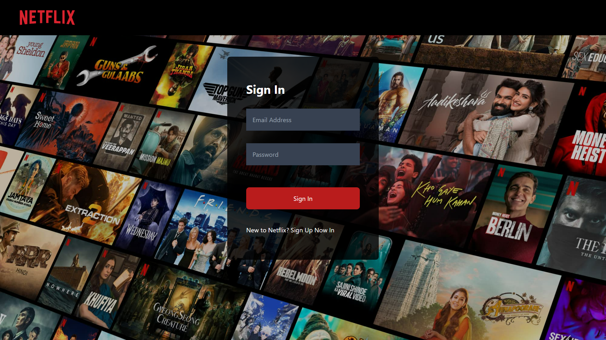
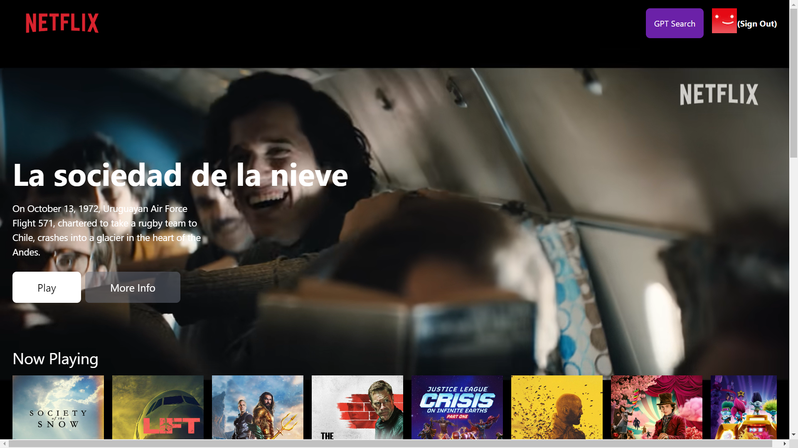
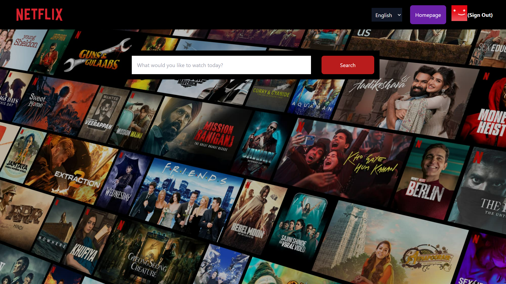
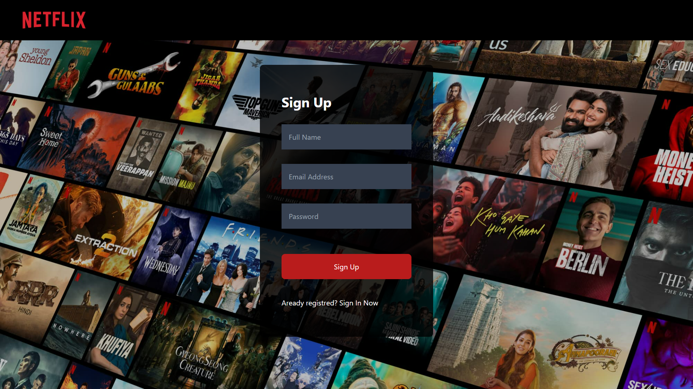

Welcome to the <b>Netflix Clone project!</b> This web application replicates the core features of Netflix, offering a seamless user experience. The project includes a Sign In and Sign Out page with<b> Firebase authentication</b> for secure user management. The Sign In page incorporates validation for enhanced security. The Home page is designed to showcase personalized movie recommendations, providing users with a dynamic and engaging content discovery experience. The application also features a powerful search option powered by <b>OpenAI API</b>, allowing users to easily find their favorite movies. 

  

  <h3>Sign In Page</h3>
  
  

  

  <h3>Home Page</h3>
   
  

  

  <h3>Search Page</h3>
   
  

  

  <h3>Sign Out Page</h3>
   
  

